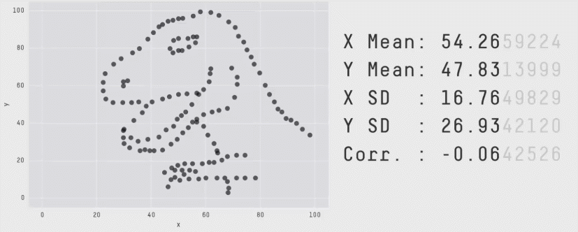
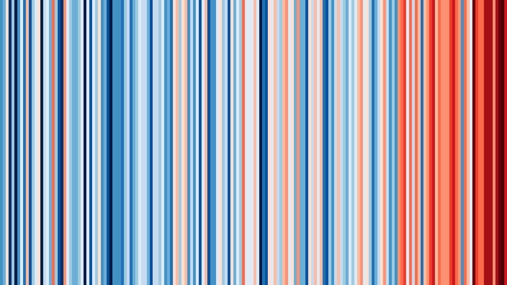



# Data Visualization: Why?

## The Data Saurus

::: {.columns}
::: {.column}
```{r}
library(tidyverse)
# install.packages("datasauRus")
library(datasauRus)
datasaurus_dozen |> 
  filter(dataset == "dino")

datasaurus_dozen |> 
  filter(dataset == "dino") |> 
    summarise(
    mean_x = mean(x),
    mean_y = mean(y),
    sd_x = sd(x),
    sd_y = sd(y),
    cor_xy = cor(x, y)
  )
```
:::
::: {.column .fragment}
```{r}
datasaurus_dozen |> 
  filter(dataset == "dino") |> 
  ggplot(aes(x = x, y = y)) +
  geom_point() +
  coord_fixed() +
  theme_minimal(base_size = 20)
```
:::
:::

## The Data Saurus and 12 Friends

```{r}
datasaurus_dozen |> 
  ggplot(aes(x = x, y = y)) +
  geom_point() +
  facet_wrap(~ dataset, ncol = 5) +
  coord_fixed() +
  theme_minimal()
```

## What do the summary statistics say?

::: {.columns}
::: {.column}

```{r}
datasaurus_dozen |> 
  summarise(
    mean_x = mean(x),
    mean_y = mean(y),
    sd_x = sd(x),
    sd_y = sd(y),
    cor_xy = cor(x, y),
    .by = dataset
  )
```
:::
::: {.column}

:::
:::


## Truth, Beauty, Facts, and Data

::: {.incremental}
- Professionals in data visualization often care about **truth** and **beauty**.
- This may appear surprising at first glance because it should be about **facts** and **data**.
- Believes behind this are   
    - **Facts require beauty to become true.**
    - **Beauty is necessary to see patterns.**
- There is no "Just show me the data!", there is always some crafting involved in showing data. 
:::

## What makes a good visual?

> "Graphical excellence is the **well-designed presentation of interesting data**—a matter of substance, of statistics, and of design … [It] consists of complex ideas communicated with clarity, precision, and efficiency. … [It] is that which gives to the viewer the **greatest number of ideas** in the **shortest time** with the **least ink** in the **smallest space** … [It] is nearly always multivariate … And graphical excellence requires **telling the truth about the data**."

Edward Tufte, *The Visual Display of Quantitative Information*


## What makes a good visual?

- Truthful
- Functional
- Beautiful
- Insightful
- Enlightening

Alberto Cairo, *The Truthful Art*


::: aside
Maybe, this is a bit too much to ask for with too big words?
::: 


## What makes a good visual? Down to earth version

- Good aesthetics
- No substantiv issues
- No perceptual issues
- Shows honesty and good judgment

Kieran Healy, *Data Visualization: A Practical Introduction*  
It is a good book, available online for free: <https://socviz.co/>


# Grammar of Graphics

Mapping data to aesthetic attributes of geometric objects.

## Basic Ideas

1. **Map data to aesthetics.**    
    Data = Column in a data frame   
    Aesthetics = Visual attributes (x, y, color, size, shape, ...)

::: {.fragment}
More aesthetics
:::

2. **Use geometric objects to represent data points**  
    Geometric objects = Points, lines, bars, ...


<!-- Add examples for aesthetcis -->

## More aesthetics 

<!-- To Do: z, alpha, a color biscale, labels
With interactive graphs: Time as slider, extensive labels not only for names, also for additional data, more conplex shapes with fill and border color-->

## Gapminder

```{r}
library(gapminder)
gapminder |> 
  filter(year == 2007) |> 
  ggplot(aes(x = gdpPercap, y = lifeExp, color = continent, size = pop)) +
  geom_point() + 
  scale_x_log10() +
  scale_size_area(max_size = 15) +
  theme_minimal()
```

## Gapminder

column | aesthetic `aes()` |  geom
-------|-----------|--------|---------
gdpPercap | `x = gdpPercap` | `geom_point`
lifeExp | `y = lifeExp`  | `geom_point`
continent | `color = continent` | `geom_point`
pop | `size = pop` | `geom_point`
year | - | use for filtering and facetting
## Grammatical Layers

1. Data
2. Aesthetics
3. Geometric objects
4. Scales
5. Coordinate system
6. Facets
7. Theme

# Example Gapminder Bubble Chart

## 1. Data
```{r}
gapminder |> 
  filter(year == 2007) |> 
  ggplot()
```


## 2. Aesthetics
```{r}
gapminder |> 
  filter(year == 2007) |> 
  ggplot(aes(x = gdpPercap, y = lifeExp, color = continent, size = pop))
```

## 3. Geometric objects
```{r}
gapminder |> 
  filter(year == 2007) |> 
  ggplot(aes(x = gdpPercap, y = lifeExp, color = continent, size = pop)) +
  geom_point()
```

## 4. Scales
```{r}
gapminder |> 
  filter(year == 2007) |> 
  ggplot(aes(x = gdpPercap, y = lifeExp, color = continent, size = pop)) +
  geom_point() + 
  scale_x_log10() +
  scale_size_area(max_size = 15) +
  scale_y_continuous(limits = c(20, 90))
```


## 5. Coordinate system
```{r}
gapminder |> 
  filter(year == 2007) |> 
  ggplot(aes(x = gdpPercap, y = lifeExp, color = continent, size = pop)) +
  geom_point() + 
  scale_x_log10() +
  scale_size_area(max_size = 15) +
  coord_flip()
```


## 6. Facets
```{r}
gapminder |> 
  filter(year == 2007) |> 
  ggplot(aes(x = gdpPercap, y = lifeExp, color = continent, size = pop)) +
  geom_point() +
  scale_x_log10() +
  scale_size_area(max_size = 15) +
  facet_wrap(~ continent)
```

## 7. Theme & Base Text Size
```{r}
gapminder |> 
  filter(year == 2007) |> 
  ggplot(aes(x = gdpPercap, y = lifeExp, color = continent, size = pop)) +
  geom_point() + 
  scale_x_log10() +
  scale_size_area(max_size = 15) +
  theme_minimal(base_size = 14)
```

## More things: Labels

```{r} 
gapminder |> 
  filter(year == 2007) |> 
  ggplot(aes(x = gdpPercap, y = lifeExp, color = continent, size = pop)) +
  geom_point() + 
  scale_x_log10() +
  scale_size_area(max_size = 15) +
  labs(
    title = "Gapminder 2007",
    subtitle = "Life Expectancy vs. GDP per Capita",
    x = "GDP per Capita (log scale)",
    y = "Life Expectancy",
    color = "Continent",
    size = "Population"
  ) +
  theme_minimal(base_size = 14)
```

## More things: Axis labels 

Here with the help of a new variable. 

```{r} 
gapminder |> 
  filter(year == 2007) |> 
  mutate(pop1M = pop / 1000000) |>
  ggplot(aes(x = gdpPercap, y = lifeExp, color = continent, size = pop1M)) +
  geom_point() + 
  scale_x_log10() +
  scale_size_area(max_size = 15) +
  labs(
    title = "Gapminder 2007",
    subtitle = "Life Expectancy vs. GDP per Capita",
    x = "GDP per Capita (log scale)",
    y = "Life Expectancy",
    color = "Continent",
    size = "Population\nin Millions"
  ) +
  theme_minimal(base_size = 14)
```

## More things: Final touch Aspect Ratio

Should the figure be wider, more square or even horizontal (for phones)?   
Changing the Figure width in the quarto output with `#| fig-width: 7`

```{r} 
#| echo: fenced
#| fig-width: 7
gapminder |> 
  filter(year == 2007) |> 
  mutate(pop1M = pop / 1000000) |>
  ggplot(aes(x = gdpPercap, y = lifeExp, color = continent, size = pop1M)) +
  geom_point() + 
  scale_x_log10() +
  scale_size_area(max_size = 15) +
  labs(
    title = "Gapminder 2007",
    subtitle = "Life Expectancy vs. GDP per Capita",
    x = "GDP per Capita (log scale)",
    y = "Life Expectancy",
    color = "Continent",
    size = "Population\nin Millions"
  ) +
  theme_minimal(base_size = 14)
```

## More things: Geom Labels

```{r} 
#| echo: fenced
#| fig-width: 7
gapminder |> 
  filter(year == 2007) |> 
  mutate(pop1M = pop / 1000000) |>
  ggplot(aes(x = gdpPercap, y = lifeExp, color = continent, size = pop1M, label = country)) +
  geom_point() + 
  geom_label(size = 2) +
  scale_x_log10() +
  scale_size_area(max_size = 15) +
  labs(
    title = "Gapminder 2007",
    subtitle = "Life Expectancy vs. GDP per Capita",
    x = "GDP per Capita (log scale)",
    y = "Life Expectancy",
    color = "Continent",
    size = "Population\nin Millions"
  ) +
  theme_minimal(base_size = 14)
```

## More things: Geom Selected Labels 

First Try: Make new column

```{r} 
#| echo: fenced
#| fig-width: 7
gapminder |> 
  filter(year == 2007) |> 
  mutate(
    pop1M = pop / 1000000,
    selected_labels = if_else(country %in% c("India", "China"), country, "")
    ) |>
  ggplot(aes(
    x = gdpPercap, 
    y = lifeExp, 
    color = continent, 
    size = pop1M, 
    label = selected_labels)) +
  geom_point() + 
  geom_label(size = 4) +
  scale_x_log10() +
  scale_size_area(max_size = 15) +
  labs(
    title = "Gapminder 2007",
    subtitle = "Life Expectancy vs. GDP per Capita",
    x = "GDP per Capita (log scale)",
    y = "Life Expectancy",
    color = "Continent",
    size = "Population\nin Millions"
  ) +
  theme_minimal(base_size = 14)
```

## More things: Geom Selected Labels 

Second Try: New data frame

```{r} 
#| echo: fenced
#| fig-width: 7
gapminder |> 
  filter(year == 2007) |> 
  mutate(pop1M = pop / 1000000) |>
  ggplot(aes(
    x = gdpPercap, 
    y = lifeExp, 
    color = continent, 
    size = pop1M)) +
  geom_point() + 
  geom_label(
    data = gapminder |> 
      filter(year == 2007, (country == "China" | country == "India")) |> 
      mutate(pop1M = pop / 1000000),
    mapping = aes(x = gdpPercap, y = lifeExp, label = country),
    size = 4) +
  scale_x_log10() +
  scale_size_area(max_size = 15) +
  labs(
    title = "Gapminder 2007",
    subtitle = "Life Expectancy vs. GDP per Capita",
    x = "GDP per Capita (log scale)",
    y = "Life Expectancy",
    color = "Continent",
    size = "Population\nin Millions"
  ) +
  theme_minimal(base_size = 14)
```


## More things: Facet two years 

```{r} 
#| echo: fenced
gapminder |>  
  filter(year == 2007 | year == 1952) |> 
  mutate(pop1M = pop / 1000000) |>
  ggplot(aes(
    x = gdpPercap, 
    y = lifeExp, 
    color = continent, 
    size = pop1M)) +
  geom_point() + 
  geom_label(
    data = gapminder |> 
      filter((year == 2007 | year == 1952), (country == "China" | country == "India")) |> 
      mutate(pop1M = pop / 1000000),
    mapping = aes(x = gdpPercap, y = lifeExp, label = country),
    size = 4) +
  scale_x_log10() +
  scale_size_area(max_size = 15) +
  facet_wrap(~ year) +
  labs(
    title = "Gapminder 2007",
    subtitle = "Life Expectancy vs. GDP per Capita",
    x = "GDP per Capita (log scale)",
    y = "Life Expectancy",
    color = "Continent",
    size = "Population\nin Millions"
  ) +
  theme_minimal(base_size = 14)
```

## More things: Add a path 

```{r} 
#| echo: fenced
gapminder |>  
  filter(year == 2007) |> 
  mutate(pop1M = pop / 1000000) |>
  ggplot(aes(
    x = gdpPercap, 
    y = lifeExp, 
    color = continent, 
    size = pop1M)) +
  geom_point() + 
  geom_label(
    data = gapminder |> 
      filter((year == 2007), (country == "China" | country == "India")) |> 
      mutate(pop1M = pop / 1000000),
    mapping = aes(x = gdpPercap, y = lifeExp, label = country),
    size = 4) +
  geom_path(
    data = gapminder |> 
      filter(country == "China" | country == "India") |> 
      mutate(pop1M = pop / 1000000),
    mapping = aes(x = gdpPercap, y = lifeExp),
    size = 1) +
  scale_x_log10() +
  scale_size_area(max_size = 15) +
  labs(
    title = "Gapminder 2007",
    subtitle = "Life Expectancy vs. GDP per Capita",
    x = "GDP per Capita (log scale)",
    y = "Life Expectancy",
    color = "Continent",
    size = "Population\nin Millions"
  ) +
  theme_minimal(base_size = 14)
```

## More things: Add a path 

Order layers and make groups correctly

```{r} 
#| echo: fenced
gapminder |>  
  filter(year == 2007) |> 
  mutate(pop1M = pop / 1000000) |>
  ggplot(aes(
    x = gdpPercap, 
    y = lifeExp, 
    color = continent, 
    size = pop1M)) +
  geom_path(
    data = gapminder |> 
      filter(country == "China" | country == "India") |> 
      mutate(pop1M = pop / 1000000),
    mapping = aes(x = gdpPercap, y = lifeExp, group = country),
    size = 1) +
  geom_point() + 
  geom_label(
    data = gapminder |> 
      filter((year == 2007), (country == "China" | country == "India")) |> 
      mutate(pop1M = pop / 1000000),
    mapping = aes(x = gdpPercap, y = lifeExp, label = country),
    size = 4) +
  scale_x_log10() +
  scale_size_area(max_size = 15) +
  labs(
    title = "Gapminder 2007",
    subtitle = "Life Expectancy vs. GDP per Capita",
    x = "GDP per Capita (log scale)",
    y = "Life Expectancy",
    color = "Continent",
    size = "Population\nin Millions"
  ) +
  theme_minimal(base_size = 14)
```


# Rethink Aesthetics and Scope on the same data

## Another Example: Line plot

```{r}
gapminder |> 
  filter(continent == "Asia") |> 
  ggplot(aes(x = year, y = lifeExp)) +
  geom_line() +
  geom_point()
```


## Another Example: Line plot

```{r}
gapminder |> 
  filter(continent == "Asia") |> 
  ggplot(aes(x = year, y = lifeExp, color = country)) +
  geom_line() +
  geom_point()
```

## Another Example: Line plot

```{r}
gapminder |> 
  filter(continent == "Asia") |> 
  ggplot(aes(x = year, y = lifeExp, group = country)) +
  geom_line() +
  geom_point() +
  theme_minimal()
```


## Another Example: Line plot

```{r}
gapminder |> 
  mutate(
    country_highlight = if_else(country %in% c("China", "India"), country, "Other Asia")
    ) |>
  filter(continent == "Asia") |> 
  ggplot(aes(x = year, y = lifeExp, group = country, color = country_highlight)) +
  geom_line() +
  geom_point() +
  scale_color_manual(values = c("China" = "red", "India" = "blue", "Other Asia" = "grey")) +
  labs(
    title = "Life Expectancy in Asia",
    subtitle = "Highlighting China and India",
    x = "Year",
    y = "Life Expectancy",
    color = "Country"
  ) +
  theme_minimal()
```


## Another Example: Line plot more columns

```{r}
gapminder |> 
  mutate(
    country_highlight = if_else(country %in% c("China", "India"), country, "Other Asia"),
    logGDP = log10(gdpPercap)
    ) |>
  pivot_longer(cols = c(logGDP, lifeExp), names_to = "measure", values_to = "value") |>
  filter(continent == "Asia") |> 
  ggplot(aes(x = year, y = value, group = country, color = country_highlight)) +
  geom_line() +
  geom_point() +
  scale_color_manual(values = c("China" = "red", "India" = "blue", "Other Asia" = "grey")) +
  facet_wrap(~ measure, scales = "free_y", ncol = 1) +
  theme_minimal()
```

# Example: Data as Message and Design

## Stripes: What is this?

```{r}
warming_stripe_colors <- c("#67000d", "#a50f15", "#cb181d", "#ef3b2c", "#fb6a4a", 
                           "#fc9272", "#fcbba1", "#fee0d2", "#FFFFFF", "#deebf7", "#c6dbef", 
                           "#9ecae1", "#6baed6", "#4292c6", "#2171b5", "#08519c", "#08306b")
temperature <- read_csv("data/HadCRUT.5.0.2.0.analysis.summary_series.global.annual.csv") 
temperature |> 
  ggplot(aes(x = Time, y = 1, fill = `Anomaly (deg C)`)) +
  geom_tile() +
  scale_fill_gradientn(colors = rev(warming_stripe_colors)) +
  scale_y_continuous(expand = c(0,0)) +
  scale_x_continuous(expand = c(0,0)) +
  theme_void() +
  theme(legend.position = "none")
```

## Warming Stripes

[Warming Stripes](https://en.wikipedia.org/wiki/Warming_stripes)

{height=200px}

Data can be retrieved from <https://www.metoffice.gov.uk/hadobs/hadcrut5/>. 
HadCRUT5 is a gridded dataset of global historical surface temperature anomalies relative to a 1961-1990 reference period. 

## With a Line Polt

```{r}
temperature |> 
  ggplot(aes(x = Time, y = `Anomaly (deg C)`, color = `Anomaly (deg C)`)) +
  geom_point(size = 2.5) +
  geom_line() +
  scale_color_gradientn(colors = rev(warming_stripe_colors)) +
  scale_y_continuous(expand = c(0,0)) +
  scale_x_continuous(expand = c(0,0)) +
  theme_minimal() +
  theme(legend.position = "none")
```

- Better quantitative understanding, less decorative 


## Local Warming Stripes

Check the version for your home city: [#ShowYourStripes](https://showyourstripes.info). This is Bremen




# Back to Bubbles with more Variables

## Explore Bubble Plots 

We have variables mostly from the World Bank and WHO. The data is in the file `lectures/data/country_panel_wdi_who.csv`. The variables are:

<details><summary><code>country_name</code> / <code>country_code</code> / <code>year</code></summary>
Country name (WB standard), ISO3 code (join key), calendar year.
</details>

<details><summary><code>region</code> <em>(categorical)</em></summary>
World Bank geographic region, e.g. "Sub-Saharan Africa". Aggregates already excluded.
</details>

<details><summary><code>income_group</code> <em>(categorical)</em></summary>
WB income classification: Low / Lower middle / Upper middle / High income, based on GNI per capita.
</details>

<details><summary><code>total_population</code> — SP.POP.TOTL</summary>
Total population, midyear estimate, counting all residents regardless of legal status or citizenship.
</details>

<details><summary><code>gdp_total_usd</code> — NY.GDP.MKTP.CD</summary>
Gross domestic product, current US$.
</details>

<details><summary><code>gdp_per_capita_usd</code> — NY.GDP.PCAP.CD</summary>
GDP divided by midyear population, current US$.
</details>

<details><summary><code>life_expectancy_years</code> — SP.DYN.LE00.IN</summary>
Years a newborn would live under current mortality patterns.
</details>

<details><summary><code>secondary_enrollment_gross_pct</code> — SE.SEC.ENRR</summary>
Gross secondary school enrollment, % of official secondary-age population (can exceed 100%).
</details>

<details><summary><code>unemployment_rate_pct</code> — SL.UEM.TOTL.ZS</summary>
Share of labor force without work but available/seeking (modeled ILO estimate).
</details>

<details><summary><code>inflation_cpi_pct</code> — FP.CPI.TOTL.ZG</summary>
Annual % change in consumer price index.
</details>

<details><summary><code>fuel_exports_pct_merch_exports</code> — TX.VAL.FUEL.ZS.UN</summary>
Mineral fuels (oil, gas, coal) as % of total merchandise exports — not petroleum-only.
</details>

<details><summary><code>fuel_imports_pct_merch_imports</code> — TM.VAL.FUEL.ZS.UN</summary>
Mineral fuels (oil, gas, coal) as % of total merchandise imports — not petroleum-only.
</details>

<details><summary><code>voice_accountability_index</code> — GOV_WGI_VA.EST</summary>
Democracy/governance perception estimate (~ -2.5 weak to 2.5 strong). Starts 1996, biennial pre-2002.
</details>

<details><summary><code>obesity_prevalence_pct</code> — NCD_BMI_30C (WHO GHO)</summary>
% of adults (18+) with BMI ≥ 30, crude estimate, both sexes. Modeled, irregular update years.
</details>


## Explore Bubble Plots {.scrollable}

```{webr}
#| context: setup
#| echo: false
#| message: false
library(dplyr)
library(ggplot2)
library(readr)
gapminder <- read_csv("data/country_panel_wdi_who.csv", show_col_types = FALSE)
```

```{webr}
#| warning: false
y <- 2020
gapminder |>
  filter(year == y) |>
  ggplot(aes(x = gdp_per_capita_usd, y = life_expectancy_years, 
             color = region, size = total_population)) +
  geom_point() +
  scale_x_log10(labels = scales::label_number(big.mark = ",")) +
  scale_size_area(max_size = 15) +
  labs(title = y) +
  theme_minimal(base_size = 14) +
  theme(legend.position = "bottom") +
  guides(
    size = "none",
    color = guide_legend(ncol = 2, override.aes = list(size = 4), title = NULL)
  )
```


## Do your own!

Now, move over to your own repository, using the template repo **"VisCom_Playground"**. 
