# What you should have for your Data Story already!

## Storyboard {.smaller}

Dykes' Storytelling Arc

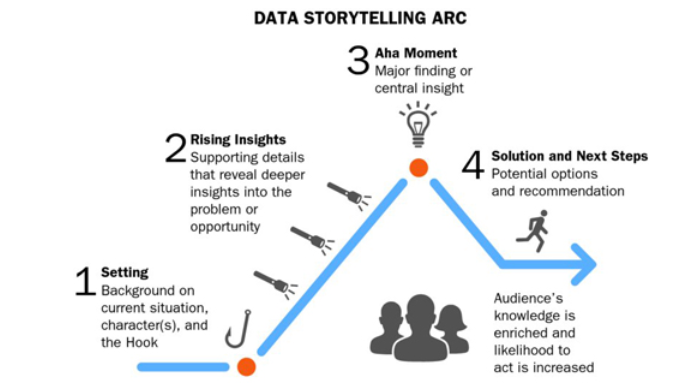

## Storyboard example {.smaller}

Storyboard for a presentation of the datastory [The summer break effects on the CoViD-19 pandemic in Germany 2020-2022](https://janlorenz.github.io/summerbreakcovid/)

[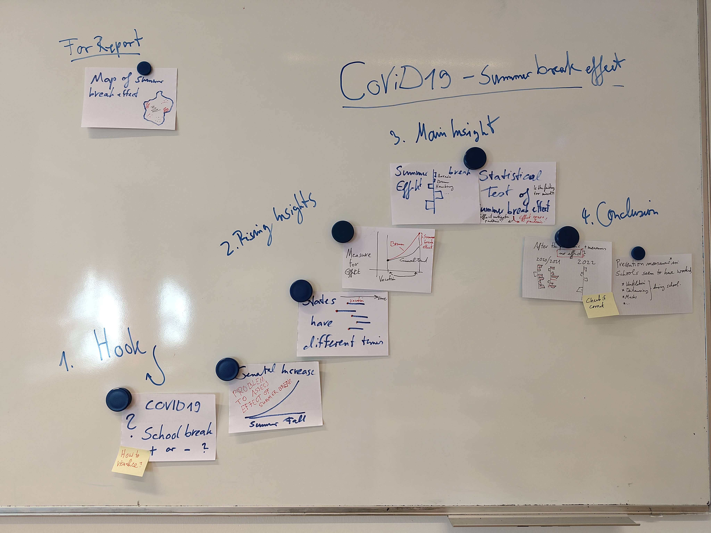{width=65%}](style="text-align:center;")

## Checklist: Datastory Presentation Essentials

Most important:

- **What is your hook?**   
Make clear what the story is about. Provide context.
- **What is your main Point?**    
Select one among all the story points you have.

Then:

- **What are the rising insights?**   
Story points to make one after the other from the hook to the main point.
- **What are the conclusion?**     
Depending on the assumed audience. 

## Slidedeck

Have most Visuals for your Story Points drafted in code!

# On Visuals (Part 1): Setting the Scenes of Your Data Story

Double check for all your visuals!

## Goals for Visual Storytelling

- As data storyteller, you bear the burden of comprehension - not your audience. 
- Make it as easy as possible for your audience to understand your visuals and follow
your overall story.

## Principles Visual Data Storytelling

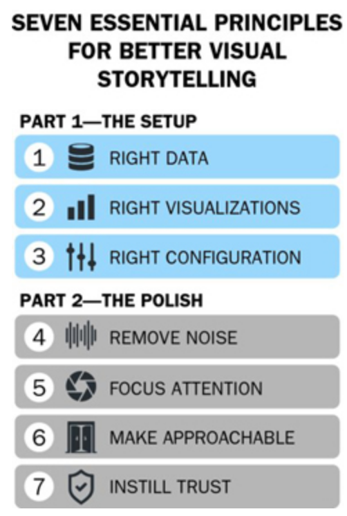{height=600}

## 1. Visualize Right Data

Data Variations to Consider

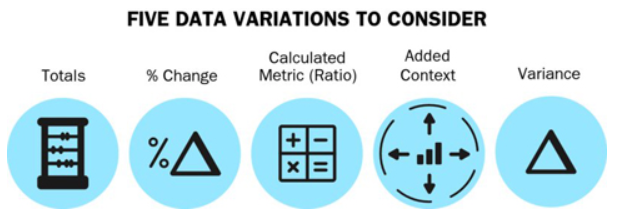

## 1. Visualize Right Data: Example

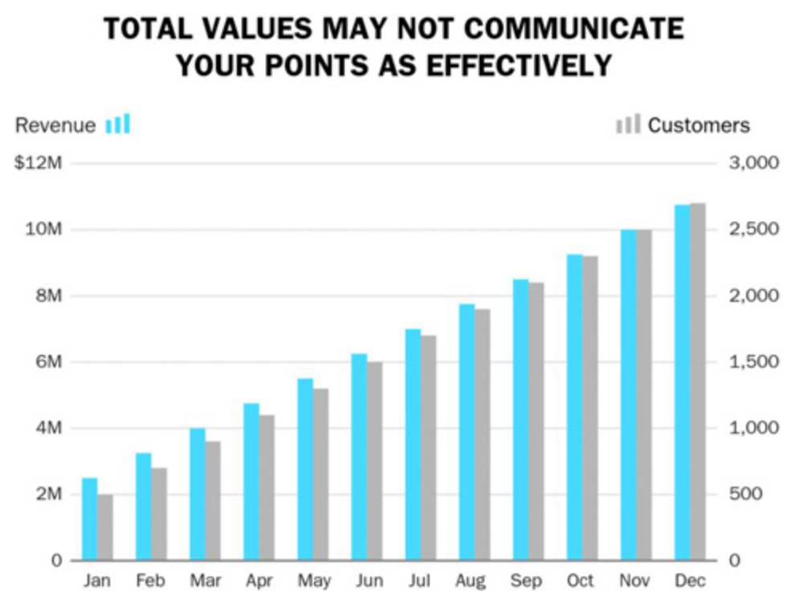{height=550}

## 1. Visualize Right Data: Example

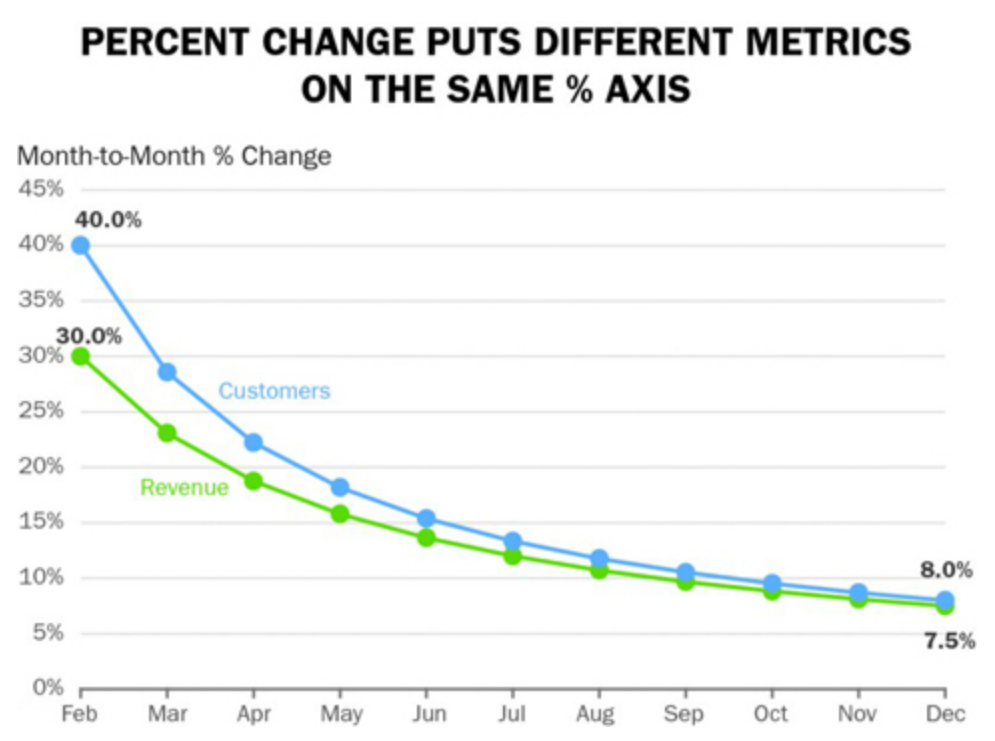{height=550}

## 1. Visualize Right Data: Example

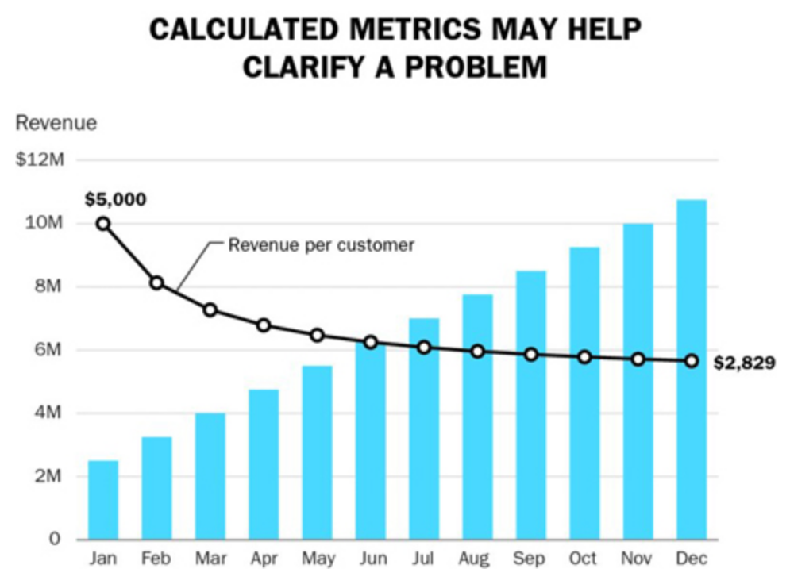{height=550}

## 2. Right Visual: Choose best fitting

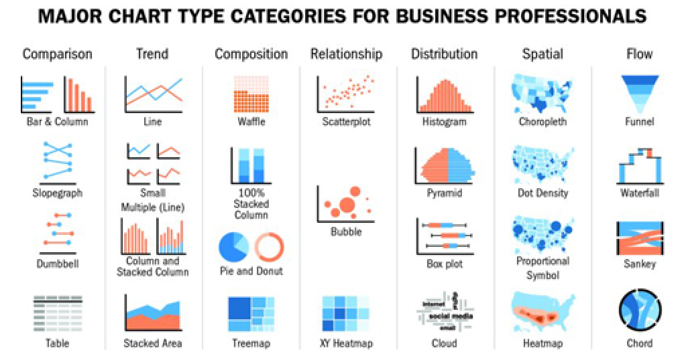

## 2. Right Visual: Accurate comparison

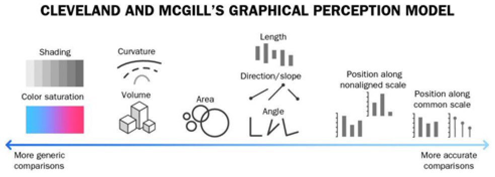{height=240}

. . .

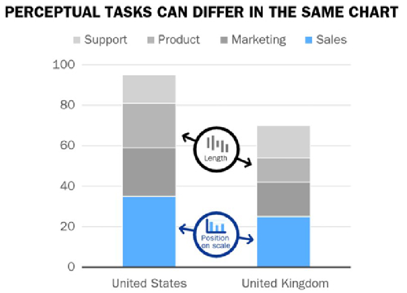{height=320}

## 2. Right Visual: Bar Chart vs. Slope Chart

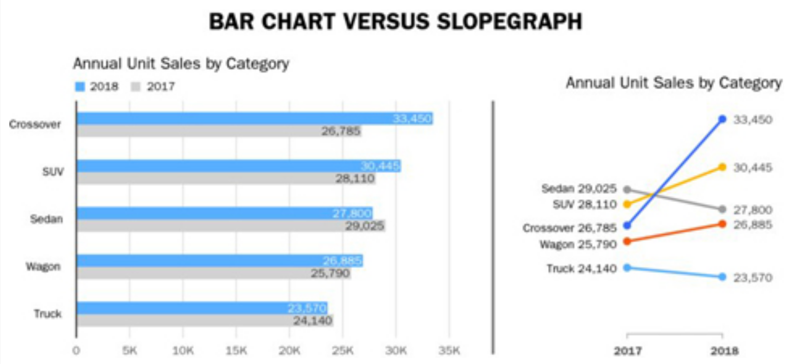

## 2. Right Visual: Pie vs. Bars

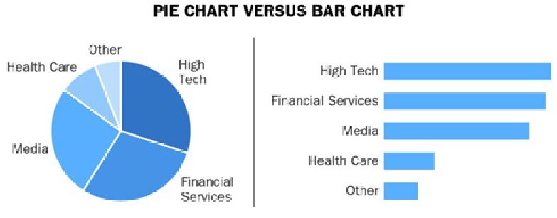

What is easy to grasp, what not?

- If you use a Pie chart, thingk about if the total sum is some sensible total! 
  - Example: If it is about market share do your item represent the whole market? 
  - Example: It is is about world population, do you cover (almost) all countries?
- If you use a Pie chart of percentages make sure things add up to 100%! 

## 3. Calibrate Visuals to Message

1. Keep comparisons in close proximity   
Put the things you compare close to each other
2. Provide a common baseline for comparisons    
Can you provide a baseline for your comparison?
3. Ensure charts are consistent for comparisons    
Do you use color consistently

## 3. Calibrate visual to message

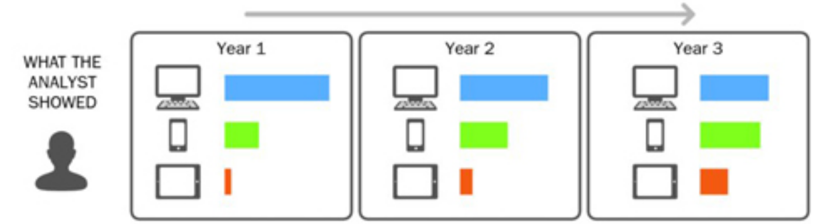

## 3. Calibrate visual to message

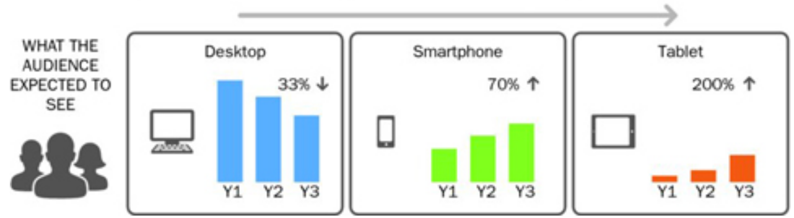

##  3. Calibrate visual to message

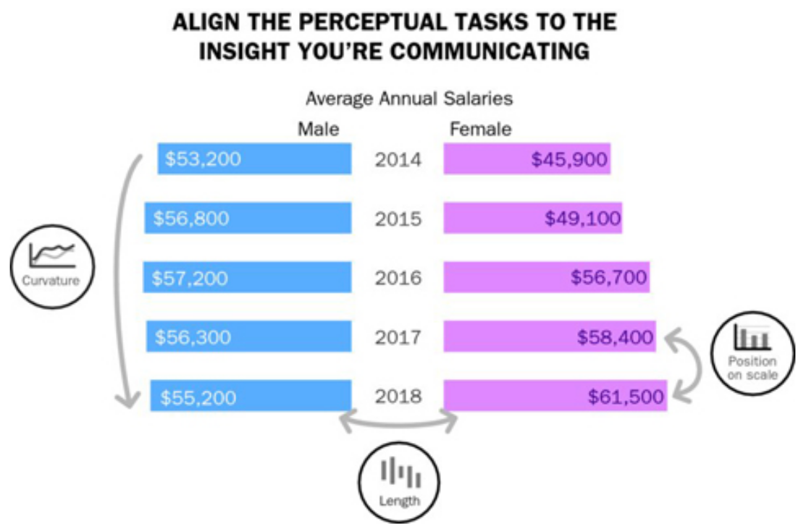{height=450}

##  3. Calibrate visual to Message

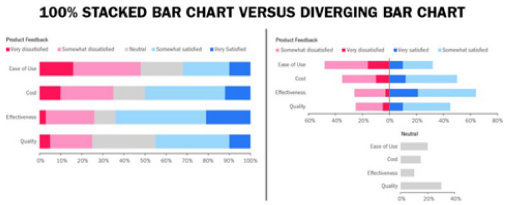

# On Visuals (Part 2): Polishing the Scenes of Your Data Story

Go through polishing checklists for all your visuals.  

## 4. Remove unneccessary noise

1. Remove surplus data
2. Aggregate less important data
3. Separate overlapping data   
Should you facet a graphic?

Remove/reduce chartjunk

## 5. Focus attention on what is important

- Which color palettes?
- Use color vs. gray
- Use text (or other) annotations
- Try to find explanatory and not purely descriptive titles

## 6. Make data approachable/engaging

::: {.columns}
::: {.column width="30%"}
Make Your Data Approachable and Engaging

  - Tips to Streamline Readability of Charts
  - Tips for Using Reference Lines
  - Tips for Formatting
  - Tips for Convention Adherence
:::
::: {.column width="69%" .fragment}
Practically: 

- Make axis labels
- Consider direct labels
- Avoid vertical or diagonal text if possible
- Use simple axis increments, avoid scientific notation of numbers (no 1e6)
- Can you use meaningful guidelines, anchorlines, trendlines, shaded regions, gridlines
- Sort categories? 
- Use transparency to show overplotting
- "Independent" variable on the x-axis
- ...
:::
:::

## 7. Instill trust in numbers

- Avoid practices which maybe considered as deceptive. Be careful with or explain well:
  - Truncated y-axis
  - Inconsistent date intervals
  - Inconsistent binning
  - ... 
- You may such things unconsciously! Even if not intended, it may look deceptive to your audience.

- Another way to instill trust is **providing source information** in figure captions or slide bottom notes. 
  - Here smaller fonts are fine to make clear that this is not the main point but context information. 